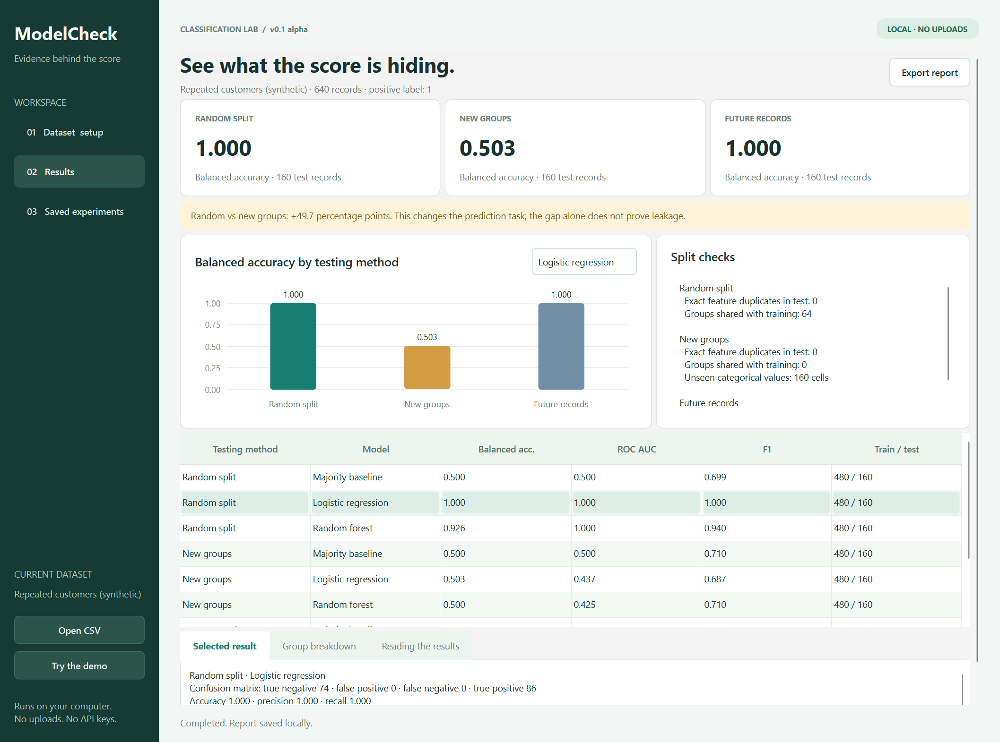
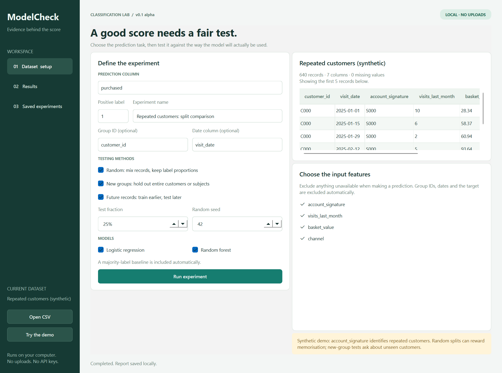

# ModelCheck

**A good score needs a fair test.**

ModelCheck is a local desktop lab for binary classification. Compare how the same model performs with a random split, entirely new groups, or future records. Inspect split overlap, keep experiment history, and export a report another person can review.

**Status: v0.1 alpha.** This is an evaluation tool, not an automatic leakage detector or a deployment approval system. The current version trains its own fixed baseline models; it does not import your existing trained model.



## Who it is for

Students, researchers and small data teams working with repeated customers, subjects, devices or dated records. Use it to investigate whether your testing method matches the prediction task. For example, predicting another visit from an existing customer is different from predicting an entirely new customer.

## What you can do

- Load a local CSV and select a two-label prediction column, positive label and input features.
- Compare stratified random, group-separated and chronological holdouts.
- Train logistic regression and random forest, alongside a majority-label baseline.
- Inspect balanced accuracy, ROC AUC, F1, precision, recall, accuracy and confusion matrices.
- Check selected-feature duplicates across training and testing, shared groups and unseen category values.
- Review test accuracy for groups with at least five records.
- Save completed experiments in a local SQLite database.
- Export readable HTML and full JSON reports with settings, dataset SHA-256, software versions and exact split membership.
- Restore a saved run's settings after loading the dataset with the same hash.

No AI API, account, server, subscription or GPU is required. Dataset loading and model fitting run in a background thread. Cancellation takes effect between stages; it does not interrupt a model fit already in progress.

## Run it

The tested environment is **Windows 11, Python 3.12**. Python 3.12–3.14 can install the pinned packages, but other Python versions and operating systems have not been tested here.

```powershell
git clone https://github.com/cannuri454-gif/modelcheck.git
cd modelcheck
python -m venv .venv
.\.venv\Scripts\python -m pip install -r requirements.txt
.\.venv\Scripts\python run.py
```

To start with fictional data:

```powershell
.\.venv\Scripts\python run.py --demo
```

There is no signed, reviewed public installer yet. The Windows workflow builds a development folder containing `ModelCheck.exe` and its supporting libraries. Extract the whole artifact before running it; do not move the executable away from `_internal`. Workflow artifact downloads require a GitHub account. See [SECURITY.md](SECURITY.md) and [THIRD_PARTY.md](THIRD_PARTY.md).

## First experiment

1. Click **Try the demo**.
2. Leave `purchased` as the target and `1` as the positive label.
3. Use `customer_id` as the group and `visit_date` as the date. Those columns are excluded from features.
4. Keep all three methods and both models selected, then click **Run experiment**.
5. Switch the chart's model selector to compare one model across the testing methods.
6. Select a table row to inspect its confusion matrix and group results.
7. Export HTML for a readable summary or JSON for full details.

The synthetic demo has 80 customers with eight visits each. `account_signature` identifies the customer through an alternative field. With the default settings, logistic regression obtains **1.000 balanced accuracy on the random holdout and approximately 0.503 on new customers**. The chronological test also scores well because the same customers return later. These are results from fictional demonstration data, not evidence of business performance.

Remove `account_signature` and repeat the experiment to explore how the results change. A score drop alone is not proof of leakage: different splits can measure different prediction tasks or different populations.



## Dataset requirements

- Comma-separated UTF-8 CSV with one header row and unique, non-empty column names.
- 20–50,000 data records, up to 200 columns and a file size of at most 100 MB.
- Exactly two target labels, no missing target labels, and at least four records per label.
- Each selected test must contain both labels in both training and testing. Otherwise the app stops with an explanation; it does not silently try different seeds until a split looks good.
- Group IDs must be complete. Dates must be readable; ISO dates such as `2026-10-02` are recommended. Ambiguous day/month formats should be converted before loading.
- Selected categorical features support up to 300 distinct values each. Exclude free-text fields and irrelevant IDs. Numeric infinities must be resolved first.

Missing numeric features are filled using training medians. Missing categorical features receive a constant marker. Numeric scaling and categorical encoding are fitted only on training records. Unseen test categories are ignored by the encoder and counted in the report. All-missing training columns receive a constant fill.

## How the tests work

| Method | What is held out | Main question |
| --- | --- | --- |
| Random | Stratified random records | Does the model work on similar records from the same data pool? |
| New groups | Entire group IDs | Does it work on customers or subjects absent from training? |
| Future records | Records at and after a timestamp boundary | Does it work on later records? |

For group tests, the percentage applies to **groups**, so the number of held-out records can differ. Time tests keep equal timestamps together and require every training timestamp to be earlier than every test timestamp. The requested fraction is approximate when timestamps are tied. Time and group methods are separate tests; this version does not enforce both restrictions in one split.

Each method uses **one holdout**, a fixed seed and fixed model settings. There is no tuning, cross-validation, automatic feature search or model selection on the test set. All models use the same record membership within a method. Full model settings are saved in JSON. Exact repeatability requires the original CSV bytes, saved settings and compatible software versions; matching the dataset hash does not guarantee identical floating-point results on every platform.

## Read the results carefully

- Balanced accuracy averages recall for both labels. A majority classifier has balanced accuracy 0.5 in these binary tests, even when ordinary accuracy is high because one label is common.
- ROC AUC describes ranking, not probability calibration. F1, precision and recall refer to the selected positive label.
- Accuracy intervals use the 95% Wilson method and assume independent records. They can be too narrow when records repeat within groups. They are not confidence intervals for the difference between testing methods.
- Group summaries show accuracy for up to the 100 largest test groups with at least five records. Small-group results can be noisy and should not be treated as fairness certification.
- Duplicate checks compare selected feature-row hashes. They do not find approximate duplicates, hidden relationships, unavailable-at-prediction features or every type of leakage.
- Review what each column means. Excluding the chosen target, ID and date does not automatically remove other fields that reveal the outcome.
- Repeatedly inspecting test results and adjusting features can itself turn the test into a tuning set. Keep a separate final evaluation dataset for serious use.

## Local storage and privacy

History is stored at `%LOCALAPPDATA%\ModelCheck\experiments.sqlite3` on Windows. The app never uploads a dataset. It stores aggregate reports, column names, label names, group summaries and data record positions, but not raw feature rows or trained model files. Reports and the database are **not encrypted**. Dataset names and group identifiers can still be sensitive; inspect reports before sharing them.

JSON record IDs are 1-based data record positions, excluding the header. They are not physical line numbers, because a quoted CSV field can contain newlines. A saved report can be opened without the original dataset; repeating the experiment requires loading that dataset again.

## Development

```powershell
.\.venv\Scripts\python -m pip install -r requirements-dev.txt
.\.venv\Scripts\python -m pytest -q
.\.venv\Scripts\python -m bandit -r modelcheck run.py tools
.\.venv\Scripts\python -m pip_audit -r requirements.txt -r requirements-dev.txt
```

Tests cover training-only preprocessing, disjoint groups, strictly ordered dates with ties, known metric values, the synthetic memorisation example, malformed CSVs, cancellation, SQLite persistence, HTML escaping, and the actual Qt worker/history/settings flow.

Architecture:

```text
CSV / synthetic demo -> validation -> split membership
                                      |
                              training-only pipeline
                                      |
                     held-out scores + split checks
                                      |
                           SQLite / HTML / JSON
```

- `modelcheck/engine.py`: validation, splits, pipelines, metrics and checks.
- `modelcheck/app.py`: Qt interface and background task lifecycle.
- `modelcheck/history.py`: local report persistence.
- `modelcheck/report.py`: JSON and escaped HTML exports.

Build an unsigned development folder on Windows:

```powershell
.\.venv\Scripts\python -m PyInstaller --noconfirm --clean --onedir --windowed --name ModelCheck --exclude-module matplotlib --exclude-module pytest run.py
.\.venv\Scripts\python tools/collect_licenses.py dist/ModelCheck
```

See [verification notes](docs/verification.md) for the checked environment and current limits. Contributions should include a reproducible example and appropriate tests. Use fictional data when opening an issue; never attach private datasets or your history database.

## License

ModelCheck's own code is MIT licensed. Dependencies retain their own licenses, including Qt/PySide's open-source terms. See [LICENSE](LICENSE) and [THIRD_PARTY.md](THIRD_PARTY.md).
